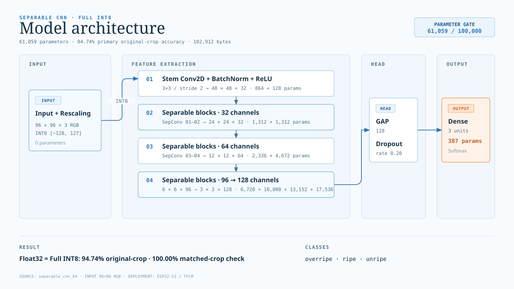
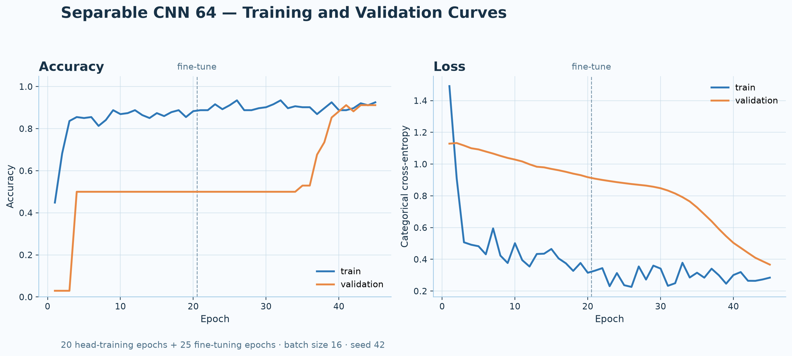
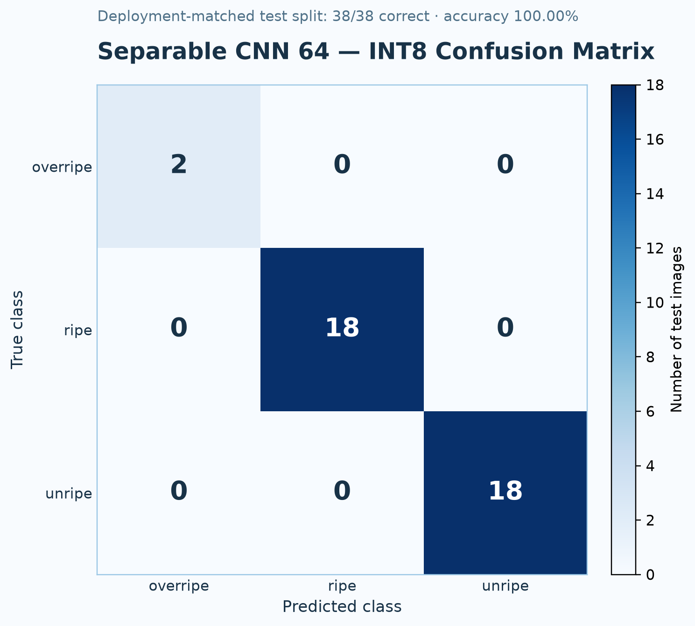

# Mini Project Report: Mangosteen Edge AI

**Project:** Edge AI classifier for mangosteen ripeness  
**Target hardware:** LilyGO T-SIMCAM / ESP32-S3, OV2640 camera, 8 MB PSRAM  
**Active model:** Separable CNN 64, Full INT8  
**Report status:** Updated from the latest parameter-constrained experiment on 2026-09-16

> **สรุปสำหรับสไลด์:** โมเดลปัจจุบันมี 61,059 parameters ซึ่งต่ำกว่าเกณฑ์ 100,000, ได้ accuracy 92.11% (35/38) ทั้ง Float32 และ Full INT8 และมีไฟล์ TFLite ขนาด 100.5 KiB

## 1. Project objective

ระบบจำแนกระดับความสุกของมังคุดเป็น 3 classes (`overripe`, `ripe`, `unripe`) บน ESP32-S3 โดยลดขนาดโมเดลให้เหมาะกับข้อจำกัดของ edge device และรักษาความแม่นยำหลัง Full INT8 quantization

เกณฑ์หลักของการเลือกโมเดลคือ:

1. จำนวน parameters ต้องไม่เกิน 100,000
2. รองรับ input `96 × 96 × 3` RGB และ output 3 classes
3. Accuracy ของ INT8 ต้องไม่ลดลงจาก Float32 ในการทดลองล่าสุด
4. แปลงเป็น TensorFlow Lite Micro model array เพื่อ build ใน firmware ได้

## 2. Dataset and preprocessing

### 2.1 Dataset split

Dataset มีภาพต้นฉบับ 239 ภาพ แบ่งเป็น train 166 ภาพ, validation 35 ภาพ และ test 38 ภาพ โดย validation และ test ไม่ผ่าน augmentation

| Split | Unripe | Ripe | Overripe | Total |
|---|---:|---:|---:|---:|
| Train (raw) | 79 | 80 | 7 | 166 |
| Validation | 17 | 17 | 1 | 35 |
| Test | 18 | 18 | 2 | 38 |
| **Train (effective)** | **79** | **80** | **56** | **215** |

ภาพ `overripe` ใน training set ถูกเพิ่มด้วย geometric augmentation จาก 7 เป็น 56 ภาพ ทำให้จำนวน training ที่ใช้จริงเป็น 215 ภาพ ส่วน validation/test ยังคงเป็นภาพที่ไม่ได้ augment เพื่อใช้วัดผลกับภาพที่ไม่ซ้ำกับ training

### 2.2 Input preprocessing

- Resize เป็น `96 × 96 × 3`
- ใช้ RGB input
- Full INT8 input quantization: scale `1.0`, zero-point `-128`
- Output tensor shape: `(1, 3)`
- ลำดับ class: `overripe`, `ripe`, `unripe`

## 3. Active model architecture

โมเดลที่เลือกใช้คือ **Separable CNN 64** ซึ่งสร้างจาก `Conv2D` และ `SeparableConv2D` แบบ depthwise-separable เพื่อจำกัดจำนวน parameters โดยไม่ใช้ pretrained backbone ขนาดใหญ่



*Figure 3.1: โครงสร้างโมเดล Separable CNN 64 สำหรับ input INT8 ขนาด 96 × 96 × 3 และ output 3 classes*

### 3.1 Layer summary

ตารางนี้เป็นการสรุปจาก `model_summary.txt` ของโมเดลที่ train ล่าสุด โดยรวม BatchNormalization กับ convolution block เดียวกันเพื่อให้อ่านง่ายในสไลด์และรายงาน

| Layer (type) | Output shape | Parameters |
|---|---:|---:|
| InputLayer + Rescaling | `96 × 96 × 3` | 0 |
| Stem Conv2D 3×3, stride 2 + BN + ReLU | `48 × 48 × 32` | 992 |
| Separable block 01 | `24 × 24 × 32` | 1,440 |
| Separable block 02 | `24 × 24 × 32` | 1,440 |
| Separable block 03 | `12 × 12 × 64` | 2,592 |
| Separable block 04 | `12 × 12 × 64` | 4,928 |
| Separable block 05 | `6 × 6 × 96` | 7,104 |
| Separable block 06 | `6 × 6 × 96` | 10,464 |
| Separable block 07 | `3 × 3 × 128` | 13,664 |
| Separable block 08 | `3 × 3 × 128` | 18,048 |
| GlobalAveragePooling2D + Dropout (`rate=0.20`) | `128` | 0 |
| Output Dense + Softmax | `3` | 387 |
| **Total** | — | **61,059** |

รายละเอียด raw model summary และ architecture JSON อยู่ใน [`04_results/current/separable_cnn_64`](../../04_results/current/separable_cnn_64/)

### 3.2 Parameter constraint

| Candidate | Parameters | INT8 accuracy | INT8 size | Decision |
|---|---:|---:|---:|---|
| Separable CNN 32 | 26,099 | 89.47% (34/38) | 58,744 bytes | ผ่านเกณฑ์ แต่ accuracy ต่ำกว่า |
| **Separable CNN 64** | **61,059** | **92.11% (35/38)** | **102,912 bytes** | **เลือกใช้** |

โมเดล MobileNetV2 รุ่นเดิมมี parameters มากกว่าเกณฑ์ จึงถูกเก็บเป็น historical baseline ใน archive และไม่ใช่ active model แล้ว

## 4. Training and quantization

การทดลองล่าสุดใช้ pipeline เดียวกันทั้ง local และ Colab โดยบันทึก `run.log`, `events.jsonl`, configuration, model summary, training history และ metrics ทุกขั้นตอน

- Head training: 20 epochs
- Fine-tuning: 25 epochs
- Batch size: 16
- Random seed: 42
- Quantization: Full Integer Post-Training Quantization (INT8)
- Output quantization: scale `0.00390625`, zero-point `-128`



*Figure 4.1: Training/validation accuracy and loss across 20 head-training epochs followed by 25 fine-tuning epochs.*

### 4.1 Accuracy comparison

| Model | Float32 accuracy | INT8 accuracy | Accuracy delta |
|---|---:|---:|---:|
| Separable CNN 32 | 89.47% (34/38) | 89.47% (34/38) | 0.00% |
| **Separable CNN 64** | **92.11% (35/38)** | **92.11% (35/38)** | **0.00%** |

### 4.2 Current INT8 test result

| Metric | Value |
|---|---:|
| Correct predictions | 35 / 38 |
| Accuracy | 92.11% |
| Balanced accuracy | 64.81% |
| Macro F1 | 0.632 |
| TFLite size | 102,912 bytes (100.5 KiB) |

The overall accuracy remains 92.11% after quantization. However, the minority `overripe` class has only 2 test samples and was not recalled correctly in this run. Therefore, overall accuracy should be reported together with balanced accuracy and per-class metrics rather than alone.

### 4.3 Per-class result



*Figure 4.2: Confusion matrix from the current Separable CNN 64 Full INT8 model on the 38-image test split.*

| Class | Precision | Recall | F1-score | Support |
|---|---:|---:|---:|---:|
| overripe | 0.000 | 0.000 | 0.000 | 2 |
| ripe | 0.857 | 1.000 | 0.923 | 18 |
| unripe | 1.000 | 0.944 | 0.971 | 18 |

This result identifies the next improvement target clearly: collect and review more difficult `overripe` examples, then rerun the same fixed test split for a fair comparison.

## 5. Edge deployment

### 5.1 Firmware path

The active deployment source is:

- TFLite model: `models/current/separable_cnn_64_int8.tflite`
- Training artifact: `training/Mangosteen_EdgeAI/03_models/current/tflite/separable_cnn_64_int8.tflite`
- Firmware array: `src/mangosteen_model_data.{h,cc}`
- Deployment mirror: `training/Mangosteen_EdgeAI/05_deployment/current/mangosteen_model_data.{h,cc}`

The active model array header identifies the architecture, parameter count and INT8 accuracy so that the firmware artifact can be traced back to the report.

### 5.2 Inference pipeline

```text
[ OV2640 camera frame: 240 × 240 RGB565 ]
                    │
                    ▼
[ Integer preprocessing: resize + RGB → INT8 ]
                    │  96 × 96 × 3
                    ▼
[ TFLM MicroInterpreter in PSRAM tensor arena ]
                    │
                    ▼
[ Separable CNN 64 INT8 ]
                    │
                    ▼
[ 3-class output: overripe / ripe / unripe ]
```

### 5.3 Verification boundary

- PlatformIO build and upload to the LilyGO T-SIMCAM on `COM9` completed successfully before this report update; serial upload reported `Hash of data verified`.
- Camera initialization and model-loading steps were observed in the serial output.
- A complete browser-based live inference session was not captured in the available evidence, so this report does not claim a verified live latency or live accuracy benchmark.

## 6. Engineering decisions and limitations

### 6.1 Why the model was reduced

The previous MobileNetV2 baseline had higher test accuracy but exceeded the project limit of 100,000 parameters. Separable CNN 64 was selected because it remained under the limit and outperformed the smaller Separable CNN 32 candidate while preserving accuracy after INT8 conversion.

### 6.2 Current limitation

The test split contains only two `overripe` samples. The current 92.11% overall accuracy therefore does not imply equally strong performance for every class. The balanced accuracy of 64.81% and the per-class table must remain in the presentation to show this limitation honestly.

### 6.3 Recommended next experiment

1. Add more verified `overripe` field images with varied lighting and surface conditions.
2. Keep validation and test images isolated from augmentation.
3. Retrain Separable CNN 64 with the same parameter gate.
4. Compare overall accuracy, balanced accuracy, macro F1, per-class recall and INT8 file size.
5. Repeat the ESP32-S3 live inference check and record measured latency only after serial/browser evidence is available.

## 7. Conclusion

Separable CNN 64 is the current deployment candidate for the project. It satisfies the hard limit with **61,059 parameters**, reaches **92.11% Float32 and INT8 accuracy (35/38)**, and produces a compact **102,912-byte Full INT8 TFLite model**. The quantization step causes **0.00% accuracy delta** in the latest fixed test split.

For slides, use Figure 3.1 together with the three headline numbers: **61,059 parameters**, **92.11% INT8 accuracy**, and **100.5 KiB model size**. For the report, retain the balanced accuracy and per-class table because the `overripe` class remains the main limitation.
