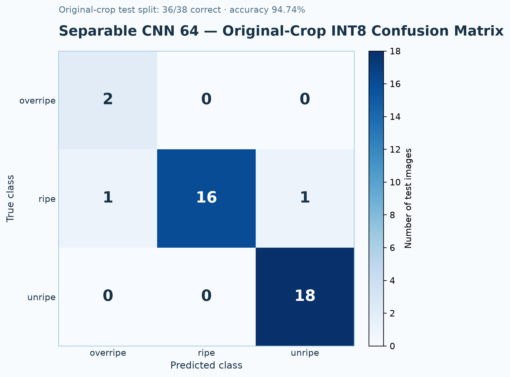

# Mini Project Report: Mangosteen Edge AI

**Project:** Edge AI classifier for mangosteen ripeness  
**Target hardware:** LilyGO T-SIMCAM / ESP32-S3, OV2640 camera, 8 MB PSRAM  
**Active model:** Separable CNN 64, Full INT8  
**Report status:** Updated from active deployment candidate run `20260917_001333` on 2026-09-17

> **สรุปสำหรับสไลด์:** โมเดลปัจจุบันมี 61,059 parameters, validation accuracy 91.18% (31/34), Original-Crop Robustness Accuracy 94.74% (36/38) ทั้ง Float32 และ Full INT8 และมีไฟล์ TFLite ขนาด 100.5 KiB. ยังไม่มีการยืนยัน live-camera accuracy

## 1. Project objective

ระบบจำแนกระดับความสุกของมังคุดเป็น 3 classes (`overripe`, `ripe`, `unripe`) บน ESP32-S3 โดยลดขนาดโมเดลให้เหมาะกับข้อจำกัดของ edge device และรักษาความแม่นยำหลัง Full INT8 quantization

เกณฑ์หลักของการเลือกโมเดลคือ:

1. จำนวน parameters ต้องไม่เกิน 100,000
2. รองรับ input `96 × 96 × 3` RGB และ output 3 classes
3. Accuracy ของ INT8 ต้องไม่ลดลงจาก Float32 ในการทดลองล่าสุด
4. แปลงเป็น TensorFlow Lite Micro model array เพื่อ build ใน firmware ได้

## 2. Dataset and preprocessing

### 2.1 Dataset split

Dataset สำหรับ run ปัจจุบันเป็น deployment-matched v4 มี raw source 237 ภาพและ records 286 รายการ แบ่งเป็น train 214 ภาพ, validation 34 ภาพ และ test 38 ภาพ โดย validation และ test ไม่ผ่าน augmentation

| Split | Unripe | Ripe | Overripe | Total |
|---|---:|---:|---:|---:|
| Train (effective) | 78 | 80 | 56 | 214 |
| Validation | 16 | 17 | 1 | 34 |
| Test | 18 | 18 | 2 | 38 |

ภาพ `overripe` ใน training set ถูกเพิ่มด้วย geometric augmentation จากภาพ canonical ให้เป็น 56 ภาพ ขณะที่ validation/test ยังคงเป็นภาพที่ไม่ได้ augment เพื่อใช้วัดผลกับภาพที่ไม่ซ้ำกับ training

ผลหลักที่ใช้ในการนำเสนออ้างชุดภาพ original crop ที่ snapshot ไว้ที่ `current_model/evaluation/original_crop_test/` จำนวน 38 ภาพ โดยใช้ crop เดิมขนาด 96 × 96 และไม่ผ่าน augmentation

### 2.2 Input preprocessing

- Resize เป็น `96 × 96 × 3`
- ใช้ RGB input
- Full INT8 input quantization: scale `1.0`, zero-point `-128`
- Output tensor shape: `(1, 3)`
- ลำดับ class: `overripe`, `ripe`, `unripe`

## 3. Active model architecture

โมเดลที่เลือกใช้คือ **Separable CNN 64** ซึ่งสร้างจาก `Conv2D` และ `SeparableConv2D` แบบ depthwise-separable เพื่อจำกัดจำนวน parameters โดยไม่ใช้ pretrained backbone ขนาดใหญ่


*Figure 3.1: โครงสร้างโมเดล Separable CNN 64 สำหรับ input INT8 ขนาด 96 × 96 × 3 และ output 3 classes*

### 3.1 Layer summary

ตารางนี้เป็นการสรุปจาก `model_summary.txt` ของโมเดลที่ train ล่าสุด โดยรวม BatchNormalization กับ convolution block เดียวกันเพื่อให้อ่านง่ายในสไลด์และรายงาน

| Layer (type) | Output shape | Parameters |
|---|---:|---:|
| InputLayer + Rescaling | `96 × 96 × 3` | 0 |
| Stem Conv2D 3×3, stride 2 + BN + ReLU | `48 × 48 × 32` | 992 |
| Separable block 01 | `24 × 24 × 32` | 1,440 |
| Separable block 02 | `24 × 24 × 32` | 1,440 |
| Separable block 03 | `12 × 12 × 64` | 2,592 |
| Separable block 04 | `12 × 12 × 64` | 4,928 |
| Separable block 05 | `6 × 6 × 96` | 7,104 |
| Separable block 06 | `6 × 6 × 96` | 10,464 |
| Separable block 07 | `3 × 3 × 128` | 13,664 |
| Separable block 08 | `3 × 3 × 128` | 18,048 |
| GlobalAveragePooling2D + Dropout (`rate=0.20`) | `128` | 0 |
| Output Dense + Softmax | `3` | 387 |
| **Total** | — | **61,059** |

รายละเอียด raw model summary และ architecture JSON อยู่ใน [`results/20260917_001333/separable_cnn_64`](../results/20260917_001333/separable_cnn_64/)

### 3.2 Parameter constraint

| Candidate | Parameters | INT8 accuracy | INT8 size | Decision |
|---|---:|---:|---:|---|
| Separable CNN 32 | 26,099 | 89.47% (34/38) | 58,744 bytes | earlier constrained candidate |
| **Separable CNN 64** | **61,059** | **94.74% (36/38)** | **102,912 bytes** | **เลือกใช้** |

โมเดล MobileNetV2 รุ่นเดิมมี parameters มากกว่าเกณฑ์ จึงถูกเก็บเป็น historical baseline ใน archive และไม่ใช่ active model แล้ว

## 4. Training and quantization

การทดลองล่าสุดใช้ pipeline เดียวกันทั้ง local และ Colab โดยบันทึก `run.log`, `events.jsonl`, configuration, model summary, training history และ metrics ทุกขั้นตอน

- Head training: 20 epochs
- Fine-tuning: 25 epochs
- Batch size: 16
- Random seed: 42
- Quantization: Full Integer Post-Training Quantization (INT8)
- Output quantization: scale `0.00390625`, zero-point `-128`


*Figure 4.1: Training/validation accuracy and loss across 20 head-training epochs followed by 25 fine-tuning epochs.*

### 4.1 Accuracy comparison

| Model | Float32 accuracy | INT8 accuracy | Accuracy delta |
|---|---:|---:|---:|
| Separable CNN 32 | 89.47% (34/38) | 89.47% (34/38) | 0.00% |
| **Separable CNN 64** | **94.74% (36/38)** | **94.74% (36/38)** | **0.00%** |

### 4.2 Current validation and INT8 test result

| Metric | Value |
|---|---:|
| Validation correct predictions | 31 / 34 |
| Validation accuracy | 91.18% |
| Original-crop Float32 correct predictions | 36 / 38 |
| Original-crop Full INT8 correct predictions | 36 / 38 |
| Original-crop accuracy | 94.74% |
| Balanced accuracy | 96.30% |
| Macro F1 | 0.905 |
| TFLite size | 102,912 bytes (100.5 KiB) |

The original-crop evaluation remains 94.74% after quantization, with no accuracy drop from Float32. The deployment-matched crop check is 100.00% for both precisions. The test set contains only two `overripe` samples and neither offline result establishes real-camera accuracy.

### 4.3 Per-class result



*Figure 4.2: Confusion matrix from the current Separable CNN 64 Full INT8 model on the original 96×96 crop test split.*

| Class | Precision | Recall | F1-score | Support |
|---|---:|---:|---:|---:|
| overripe | 0.667 | 1.000 | 0.800 | 2 |
| ripe | 1.000 | 0.889 | 0.941 | 18 |
| unripe | 0.947 | 1.000 | 0.973 | 18 |

This result describes the original-crop offline robustness evaluation. The matched-crop check remains 100.00% (38/38), while the next validation target is a ground-truth set captured through the real OV2640 board pipeline.

## 5. Edge deployment

### 5.1 Firmware path

The active deployment source is:

- TFLite model: `current_model/model/separable_cnn_64_int8.tflite`
- Training artifact: `current_model/model/separable_cnn_64.keras`
- Firmware array: `src/mangosteen_model_data.{h,cc}`
- Deployment mirror: `current_model/deployment/mangosteen_model_data.{h,cc}`

The active model array header identifies the architecture, parameter count and INT8 accuracy so that the firmware artifact can be traced back to the report.

### 5.2 Inference pipeline

```text
[ OV2640 camera frame: 240 × 240 RGB565 ]
                    │
                    ▼
[ Integer preprocessing: resize + RGB → INT8 ]
                    │  96 × 96 × 3
                    ▼
[ TFLM MicroInterpreter in PSRAM tensor arena ]
                    │
                    ▼
[ Separable CNN 64 INT8 ]
                    │
                    ▼
[ 3-class output: overripe / ripe / unripe ]
```

### 5.3 Verification boundary

- PlatformIO build and upload to the LilyGO T-SIMCAM on `COM9` completed successfully before this report update; serial upload reported `Hash of data verified`.
- Camera initialization and model-loading steps were observed in the serial output.
- A complete browser-based live inference session was not captured in the available evidence, so this report does not claim a verified live latency or live accuracy benchmark.

### 5.4 Deployment-domain diagnostic

The same current model was also evaluated through separate input paths to distinguish model performance from camera preprocessing:

| Input path | Accuracy | Interpretation |
|---|---:|---|
| Original 96×96 crop | 94.74% (36/38) | **Selected offline evaluation** |
| Deployment-matched fruit crop | 100.00% (38/38) | Secondary engineering check |
| Simulated RGB565 full-frame | 55.26% (21/38) | Framing/background domain shift |
| Live OV2640 board | Not measured | Ground-truth browser test still required |

The 94.74% original-crop result is the primary offline evaluation for presentation. The 100.00% matched-crop result is retained as a preprocessing check. The 55.26% simulated full-frame result shows why offline accuracy must not be presented as verified camera accuracy.

## 6. Engineering decisions and limitations

### 6.1 Why the model was reduced

The previous MobileNetV2 baseline had higher test accuracy but exceeded the project limit of 100,000 parameters. Separable CNN 64 was selected because it remained under the limit and outperformed the smaller Separable CNN 32 candidate while preserving accuracy after INT8 conversion.

### 6.2 Current limitation

The test split contains only two `overripe` samples, and the real OV2640 input path has not yet been evaluated with ground truth. The current 94.74% original-crop accuracy therefore does not imply the same field accuracy. The simulated full-frame result of 55.26% shows that framing and background can materially change the result.

### 6.3 Recommended next experiment

1. Capture a ground-truth real-camera validation set through the OV2640 and current firmware preprocessing.
2. Add more verified `overripe` field images with varied lighting and surface conditions.
3. Keep validation and test images isolated from augmentation.
4. Retrain Separable CNN 64 with the same parameter gate only after the camera-domain evidence is collected.
5. Record measured latency and camera accuracy only after serial/browser evidence is available.

## 7. Conclusion

Separable CNN 64 is the current deployment candidate for the project. It satisfies the hard limit with **61,059 parameters**, reaches **91.18% validation accuracy (31/34)** and **94.74% original-crop accuracy (36/38)** in both Float32 and Full INT8, and produces a compact **102,912-byte Full INT8 TFLite model**. The quantization step causes **0.00% accuracy delta** on the original-crop evaluation.

For slides, use Figure 3.1 together with the headline numbers: **61,059 parameters**, **91.18% validation**, **94.74% original-crop evaluation**, and **100.5 KiB model size**. Keep the 100.00% matched-crop check as a secondary engineering note and state separately that live-camera accuracy remains unverified.
